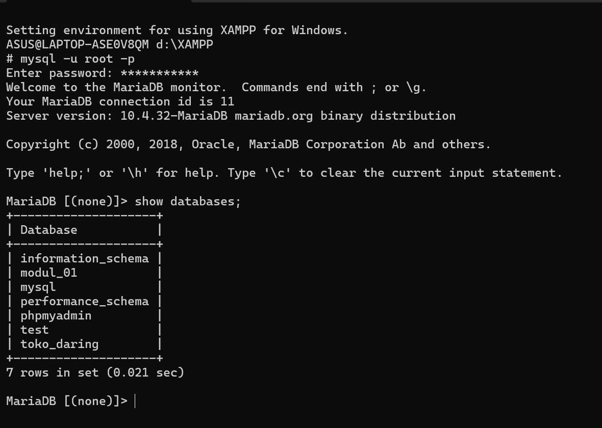
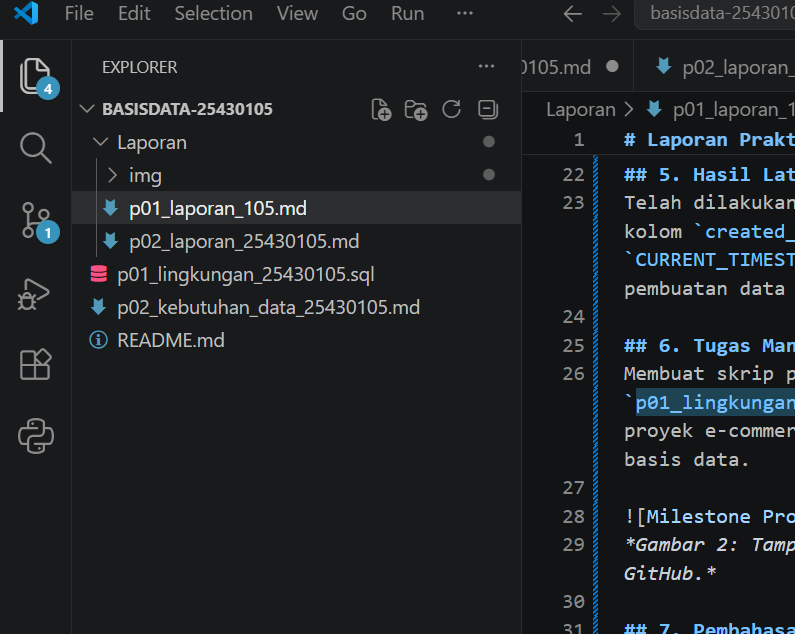

# Laporan Praktikum Basis Data - Pertemuan 01
**Nama:** Syifa   **NIM:** 2301010105   **Kelas:** Ilmu Komputer D  **Tanggal:** 29 September 2026

## 1. Tujuan Praktikum
1. Menyiapkan lingkungan kerja praktikum basis data meliputi instalasi RDBMS (MariaDB/MySQL) dan Git.
2. Memahami perintah dasar SQL untuk manajemen basis data dan tabel.
3. Mengelola repositori Git untuk penyimpanan laporan dan kode praktikum secara tersinkronisasi.
4. Menjalankan skrip SQL awal dan memverifikasi struktur basis data yang dibuat.

## 2. Ringkasan Dasar Teori
Basis data adalah kumpulan data terstruktur yang disimpan secara elektronik dan dikelola oleh Database Management System (DBMS). DBMS seperti MariaDB/MySQL memungkinkan pengguna untuk membuat, membaca, memperbarui, dan menghapus data (CRUD) menggunakan Data Definition Language (DDL) dan Data Manipulation Language (DML). Git digunakan sebagai sistem pengontrol versi (Version Control System) untuk mencatat riwayat perubahan berkas proyek dan mempermudah kolaborasi.

## 3. Hasil Langkah Percobaan

*Gambar 1: Hasil verifikasi status server MariaDB dan eksekusi skrip lingkungan kerja p01.*

## 4. Jawaban Titik Analisis
* **Titik Analisis 1**: Perintah `SHOW DATABASES;` digunakan untuk menampilkan seluruh daftar basis data yang ada di server, sedangkan `USE <nama_db>;` berfungsi untuk memilih basis data mana yang akan digunakan secara aktif sebelum mengeksekusi kueri tabel.
* **Titik Analisis 2**: Perbedaan utama tipe data `VARCHAR(n)` dan `CHAR(n)` terletak pada efisiensi ruang penyimpanan; `VARCHAR` menyimpan karakter secara fleksibel sesuai panjang teks aktual, sementara `CHAR` mengalokasikan ruang memori secara tetap sesuai batas `n`.
* **Titik Analisis 3**: Fungsi `PRIMARY KEY` adalah sebagai pengenal unik bagi setiap baris record pada tabel agar tidak terjadi duplikasi data, serta memastikan nilai kolom tersebut tidak boleh bernilai `NULL`.

## 5. Hasil Latihan dan Modifikasi
Telah dilakukan modifikasi skrip SQL awal dengan menambahkan kolom `created_at` bertipe `TIMESTAMP` dengan nilai bawaan `CURRENT_TIMESTAMP` pada tabel utama untuk mencatat waktu pembuatan data secara otomatis.

## 6. Tugas Mandiri: Milestone Proyek 01
Membuat skrip penyiapan lingkungan proyek `p01_lingkungan_25430105.sql` yang berisi pembuatan basis data proyek e-commerce, pembuatan tabel awal, serta verifikasi skema basis data.

*Gambar 2: Tampilan berkas skrip SQL proyek pada repositori GitHub.*

## 7. Pembahasan dan Kendala
* **Kendala**: Server MariaDB sempat gagal terhubung karena port standar (3306) bentrok dengan layanan lain.
* **Penyelesaian**: Menghentikan layanan yang menggunakan port tersebut melalui Task Manager dan melakukan konfigurasi ulang service MySQL/MariaDB pada XAMPP Control Panel.

## 8. Kesimpulan
Instalasi dan konfigurasi lingkungan kerja basis data serta pengujian perintah dasar SQL dan Git telah berhasil dilakukan. Seluruh berkas proyek p01 telah tersusun rapi dan terhubung dengan repositori remote GitHub.

## 9. Pernyataan Penggunaan AI
Menggunakan AI (Gemini) untuk membantu menyusun draf laporan praktikum, mengecek tata bahasa Markdown, dan memverifikasi kebenaran sintaks perintah Git.

## 10. Bukti Git
* **Tautan Repositori**: `https://github.com/syifa040706/basisdata-25430105`
* **Hash Commit**: `1d34458` (Pesan commit: `p01: setup lingkungan dan laporan praktikum 01`)

## Checklist
- [x] Identitas Laporan Lengkap
- [x] Ringkasan Dasar Teori
- [x] Tangkapan layar hasil percobaan
- [x] Jawaban Titik Analisis dijawab lengkap
- [x] Hasil Latihan dan Modifikasi
- [x] Milestone Proyek 01 terlampir
- [x] Pembahasan, Kendala, dan Kesimpulan
- [x] Pernyataan Penggunaan AI
- [x] Bukti Git terlampir